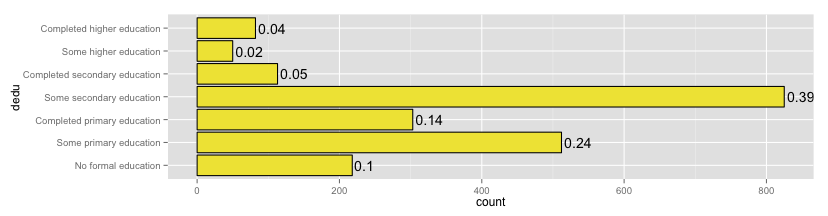
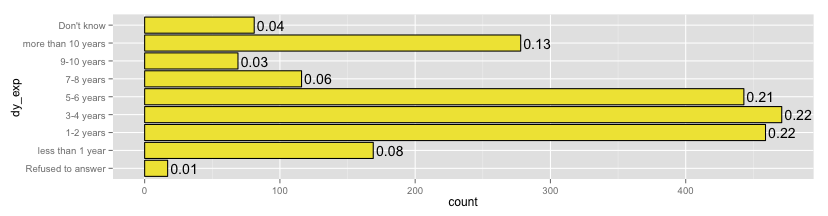
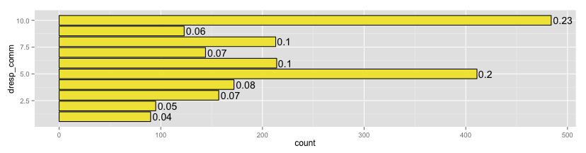
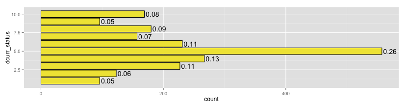

#a note about this analysis
The numbers above bar plots are percentages. Any dotted lines on histograms are the mean for that variable. 

#basic demographics
##gender
Sex/Gender are nearly identical. 

  

6% of people's gender was reported to be wrong. As a reference point, 7% of people's names and factory line, and 14% of people's salary amount were reported to be wrong.

 

Of the 6%, more Males (previously labeled as females) correcting their gender. This may be indicative of [hijrahs](http://en.wikipedia.org/wiki/Hijra_%28South_Asia%29).

 

##religion
No surprises here:
 

#family status
##children
Does the respondent have children (left) and whether or not the children reside with the respondent (right). Children **overwhelmingly** not living with parent. 

  

##marital status
Marriage numbers (left) and marriage numbers by gender (right): 

 
 

60/40 split between those that live/don't live with their spouse:

 

##dependent family
Average of 4-5 dependent family members on respondent for both food (left) and income (right).

  

#credentials
##education
 

Literacy in Bangla is 60/40 (left), however for English it's only 10/90 (right):

  

##work experience
Years at any factory (top) and years at current job (bottom):
  

Years intended to work in the future. Majority of respondents intend to work 1-6 years longer:

 

#income

Tri-modal salary spread:

 

A look at salary by gender (top), and by gender + marriage (bottom). Noteworthy that **no real difference on aggregate** for income, and that **married males make more than unmarried males**:

  

A look at spousal salary. Noteworthy that 23% of respondent spouses' do not have a salary:
 

##overtime
Overtime earnings overall (top) and by gender (bottom):
  

#10-step ladder
The following section has questions based on the 10 step ladder; the first being the worst and the tenth being the best. 

###communal respect
A quarter of respondents feel they have street cred:
 

###life: right now
Most feel like everything is in it's right place:
 

###life: in 5 years
Still most feel like things will get dramatically better:
 

###life: 5 years ago
And most feel they drastically improved:
 

#misc
##factory
 

##advice
 

